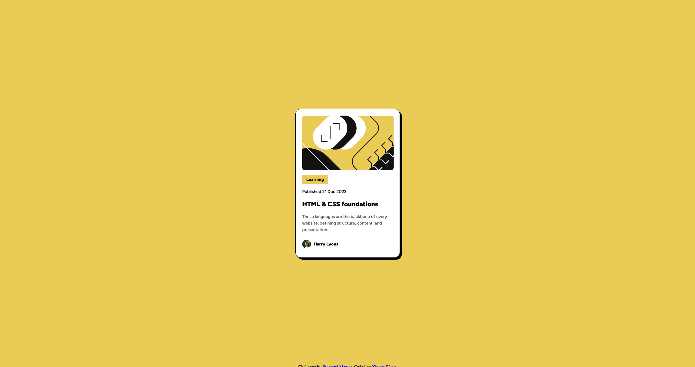

# Frontend Mentor - Blog preview card solution

This is a solution to the [Blog preview card challenge on Frontend Mentor](https://www.frontendmentor.io/challenges/blog-preview-card-ckPaj01IcS). Frontend Mentor challenges help you improve your coding skills by building realistic projects. 

## Table of contents

- [Overview](#overview)
  - [Screenshot](#screenshot)
  - [Links](#links)
- [My process](#my-process)
  - [Built with](#built-with)
  - [What I learned](#what-i-learned)
- [Author](#author)
- [Acknowledgments](#acknowledgments)

## Overview

### Screenshot

### Links

- Solution URL: [URL](https://github.com/frontend-mentor-projects-repo/blog-preview-card-main)
- Live Site URL: [URL](https://frontend-mentor-projects-repo.github.io/blog-preview-card-main)

## My process

### Built with

- Semantic HTML5 markup
- CSS custom properties
- Flexbox

### What I learned

This project is subsequent project to the brush-up [project](https://github.com/frontend-mentor-projects-repo/qr-code-component-main), which solidifies my understanding of using Flexbox.

I learned 
- to use `border`
- to use `box-shadow`
- to style common elements simultaneously
- to import and use custom font family 

After this project, I became more familiar and comfortable of using Flexbox.

## Author

- Personal Website - TBA
- LinkedIn - [Xingya Wang](https://www.linkedin.com/in/xingya-wang/)

## Acknowledgments

Special thanks to my mentor [@HarryLyons](https://github.com/GregLyons) for guidance and advice. And thanks for ChatGPT for saving my time on Google.